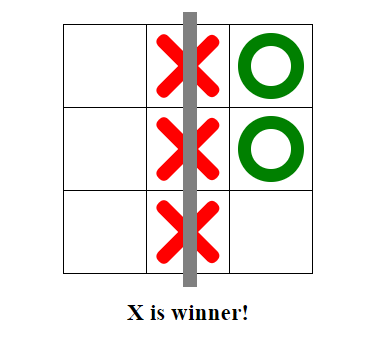

# tic-tac-toe

 ## todo
* there will be two types of players: registered and anonymous
* registered users can see their previous games (games will be stored in mongodb)
* registration through social sites (fb, github)
* rating system (list of top players)
* registered users as well as anonymous can create game (anyone can join to that game)
* creator of game can choose if he plays X or 0
* time controll

### demo [here](https://bodya17.github.io/tic-tac-toe/index.html)